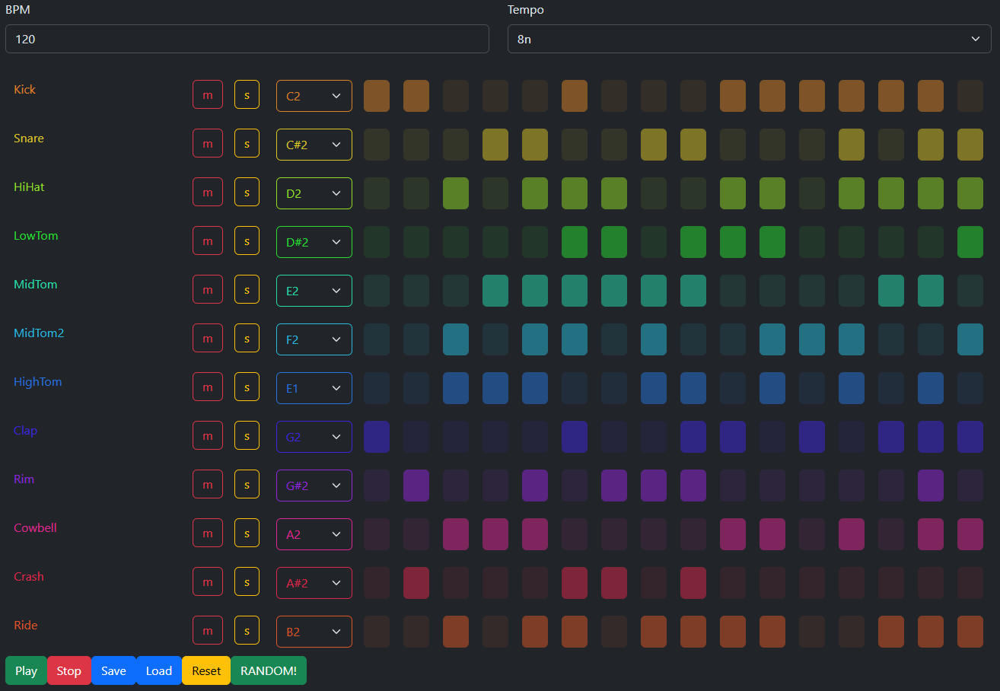

# Tone.js-Drumcomputer / -Step-Sequencer v.0.1.3

### Just a simple drumcomputer/step-sequencer using [Tone.js](https://tonejs.github.io/), [Angular](https://angular.io/) and [Bootstrap](https://getbootstrap.com).  
This is just a small project to get to know the basics of Tone.js and to find out what the Web Audio API is capable of.
More of a Step-Sequencer than a real drum computer, but who cares

### Currently, in very early alpha state

## Installation
run `git clone https://github.com/michael-graute/tonejs-drumcomputer.git`  
run `cd tonejs-drumcomputer`  
run `yarn install`

## Development server

Run `ng serve` for a dev server. Navigate to `http://localhost:4200/`. The application will automatically reload if you change any of the source files.
